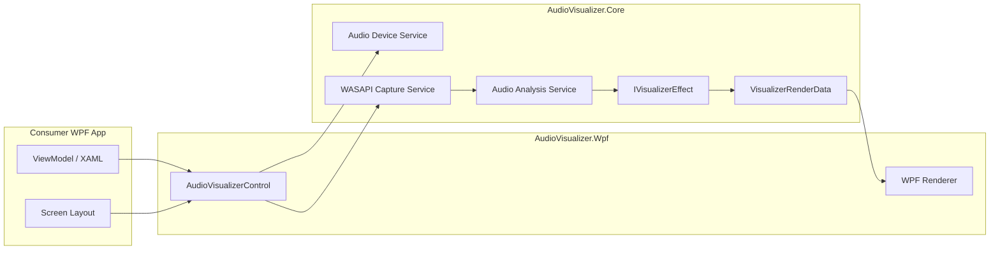

# 🧩 AudioVisualizer

- 日本語: [README.md](./README.md)

## 🏷️ Overview

AudioVisualizer is a reusable audio visualization component for WPF applications. It is implemented as a `CustomControl` and supports both system output and microphone input.

- Provides a reusable audio visualizer control for WPF
- Exposes `InputSource`, `DeviceId`, `UseDefaultDevice`, and `IsActive` as public properties
- Supports effect replacement through `IVisualizerEffect`
- Automatically adapts to the available render area, making it easier to embed in a wide range of WPF applications
- Includes `AudioVisualizer.SampleApp` for usage examples and manual verification

For detailed requirements and architecture, see [docs/01_requirements.md](./docs/01_requirements.md) and [docs/02_architect.md](./docs/02_architect.md).

## ✨ Features

- Visualization for system output and microphone input
- MVVM-friendly `CustomControl`
- Five built-in effects
  - `SpectrumBarEffect`
  - `WaveformLineEffect`
  - `MirrorBarEffect`
  - `PeakHoldBarEffect`
  - `BandLevelMeterEffect`
- Three spectrum calculation profiles
  - `Balanced`
  - `Raw`
  - `HighBoost`
- Audio device listing and default-device following
- Real-time tuning through the SampleApp

## 🎞️ Built-in Effects

### 📊 SpectrumBar

The default spectrum bar view. It is suited to checking level changes across frequency bands.


### 〰️ WaveformLine

Displays the waveform as a polyline. It works well for microphone input and quick amplitude changes.


### 🪞 MirrorBar

Draws mirrored bars from the center. It is useful when you want a more symmetrical visual style.


### 📍 PeakHoldBar

Displays normal bars together with peak hold markers. It makes recent peak positions easier to track.


### 🎚️ BandLevelMeter

Displays fixed-band levels as meters. It is useful for understanding low, mid, and high band tendencies.


## 🚀 Quick Start

1. Prepare Windows with the .NET 10 SDK.
2. Build the solution.

```powershell
dotnet build AudioVisualizer.slnx
```

3. Run the SampleApp.

```powershell
dotnet run --project AudioVisualizer.SampleApp/AudioVisualizer.SampleApp.csproj
```

4. Run the tests.

```powershell
dotnet test AudioVisualizer.slnx --no-build
```

## 🧰 Getting Started

### 🖥️ Prerequisites

- Windows
- .NET 10 SDK
- A development environment that supports WPF

### 🔧 Setup

1. Clone the repository.
2. Build the solution.
3. Run the SampleApp and verify start, stop, device switching, and effect switching.

```powershell
dotnet build AudioVisualizer.slnx
dotnet run --project AudioVisualizer.SampleApp/AudioVisualizer.SampleApp.csproj
```

### 🧪 Minimal Usage Example

```xml
<Window
    xmlns:visualizer="clr-namespace:AudioVisualizer.Wpf;assembly=AudioVisualizer.Wpf">
    <visualizer:AudioVisualizerControl
        InputSource="{Binding SelectedInputSource}"
        DeviceId="{Binding SelectedDeviceId}"
        UseDefaultDevice="{Binding UseDefaultDevice}"
        IsActive="{Binding IsActive, Mode=TwoWay}"
        Effect="{Binding SelectedEffect}"
        BarCount="{Binding BarCount}"
        Sensitivity="{Binding Sensitivity}"
        Smoothing="{Binding Smoothing}"
        SpectrumProfile="{Binding SelectedSpectrumProfile}" />
</Window>
```

## 🧰 Technology Stack

| Technology | Role | Version | Notes |
| --- | --- | --- | --- |
| C# / XAML | Implementation language |  |  |
| .NET | Runtime | 10 | `net10.0` / `net10.0-windows` |
| WPF | UI framework |  | `CustomControl` based |
| NAudio | Audio input | 2.3.0 | Uses WASAPI |
| NUnit | Testing | 4.3.2 | Unit tests |
| Microsoft.NET.Test.Sdk | Test host | 17.14.0 |  |
| NUnit3TestAdapter | Test adapter | 5.0.0 |  |
| coverlet.collector | Coverage | 6.0.4 | `XPlat Code Coverage` |

## 🏗️ Project Architecture

- `AudioVisualizer.Core` contains audio abstractions, analysis logic, effect contracts, and render-data models
- `AudioVisualizer.Wpf` contains `AudioVisualizerControl`, renderers, and built-in effects
- `AudioVisualizer.SampleApp` provides an MVVM-based usage sample and manual verification screen
- Tests are separated into `AudioVisualizer.Core.Tests`, `AudioVisualizer.Wpf.Tests`, and `AudioVisualizer.SampleApp.Tests`



## 🗂️ Project Structure

```txt
AudioVisualizer/
├── AudioVisualizer.Core/
├── AudioVisualizer.Core.Tests/
├── AudioVisualizer.Wpf/
├── AudioVisualizer.Wpf.Tests/
├── AudioVisualizer.SampleApp/
├── AudioVisualizer.SampleApp.Tests/
├── docs/
│   ├── 01_requirements.md
│   ├── 02_architect.md
│   └── 06_inplementation_plan.md
├── AGENTS.md
├── LICENSE
└── AudioVisualizer.slnx
```

## 🧭 Coding Standards

- C# uses 4-space indentation, block-scoped namespaces, and nullable reference types
- Public types and public members use `PascalCase`
- Namespaces are kept under `AudioVisualizer.*`
- WPF resources belong in `Themes/Generic.xaml`
- WPF-specific types should not leak into `AudioVisualizer.Core`
- Use the following command to verify formatting

```powershell
dotnet format AudioVisualizer.slnx --verify-no-changes
```

## 🧪 Testing

- NUnit is used as the test framework
- Tests cover Core logic, WPF behavior, and SampleApp UI logic
- Coverage is collected with `coverlet.collector`

```powershell
dotnet test AudioVisualizer.slnx --no-build
dotnet test AudioVisualizer.Wpf.Tests/AudioVisualizer.Wpf.Tests.csproj --collect:"XPlat Code Coverage"
dotnet test AudioVisualizer.SampleApp.Tests/AudioVisualizer.SampleApp.Tests.csproj --collect:"XPlat Code Coverage"
```

## 📜 License

This repository is released under the MIT License. See [LICENSE](./LICENSE) for details.
