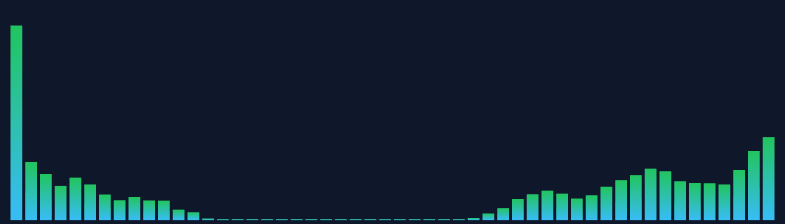
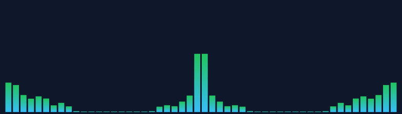
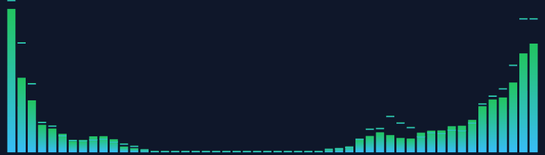
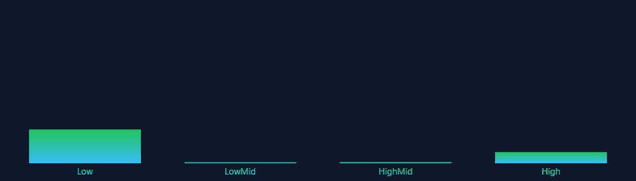
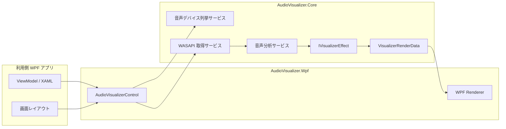

# 🧩 AudioVisualizer

- English: [README.en.md](./README.en.md)

## 🏷️ 概要

AudioVisualizer は、WPF アプリケーションへ組み込み可能な音声可視化コンポーネントです。`CustomControl` ベースで実装されており、システム再生音とマイク入力の両方を扱えます。

- WPF 向けの再利用可能な音声可視化コントロールを提供します
- `InputSource`、`DeviceId`、`UseDefaultDevice`、`IsActive` を公開プロパティで制御できます
- `IVisualizerEffect` によるエフェクト差し替えに対応しています
- 配置領域に応じて表示サイズを自動調整し、さまざまな WPF アプリへ組み込みやすい構成です
- 利用例と手動確認用に `AudioVisualizer.SampleApp` を含みます

詳細な要件と設計は [docs/01_requirements.md](./docs/01_requirements.md) と [docs/02_architect.md](./docs/02_architect.md) を参照してください。

## ✨ 主要機能

- システム再生音とマイク入力の可視化
- MVVM バインドを前提とした `CustomControl`
- 5 種類の組込エフェクト
  - `SpectrumBarEffect`
  - `WaveformLineEffect`
  - `MirrorBarEffect`
  - `PeakHoldBarEffect`
  - `BandLevelMeterEffect`
- 3 種類のスペクトラム計算プロファイル
  - `Balanced`
  - `Raw`
  - `HighBoost`
- デバイス一覧取得と既定デバイス追従
- SampleApp からのリアルタイム設定変更

## 🎞️ 組込エフェクト

### 📊 SpectrumBar

標準のスペクトラムバー表示です。帯域ごとの変化を確認しやすい既定エフェクトです。



### 〰️ WaveformLine

波形を折れ線で表示します。マイク入力や瞬間的な振幅変化の確認に向いています。


### 🪞 MirrorBar

中央基準で左右対称にバーを描画します。見た目のバランスを重視したい場面に向いています。



### 📍 PeakHoldBar

通常バーに加えてピーク保持線を表示します。最大到達位置を追いやすいエフェクトです。



### 🎚️ BandLevelMeter

固定帯域のレベルをメーター形式で表示します。低域、中域、高域の傾向を把握しやすい構成です。



## 🚀 クイックスタート

1. Windows に .NET 10 SDK を用意します。
2. ソリューションをビルドします。

```powershell
dotnet build AudioVisualizer.slnx
```

3. SampleApp を起動します。

```powershell
dotnet run --project AudioVisualizer.SampleApp/AudioVisualizer.SampleApp.csproj
```

4. テストを実行します。

```powershell
dotnet test AudioVisualizer.slnx --no-build
```

## 🧰 はじめに（Getting Started）

### 🖥️ 前提条件

- Windows
- .NET 10 SDK
- WPF が利用できる開発環境

### 🔧 セットアップ

1. リポジトリを取得します。
2. ソリューションをビルドします。
3. SampleApp を起動して、開始、停止、デバイス切替、エフェクト切替を確認します。

```powershell
dotnet build AudioVisualizer.slnx
dotnet run --project AudioVisualizer.SampleApp/AudioVisualizer.SampleApp.csproj
```

### 🧪 最小利用例

```xml
<Window
    xmlns:visualizer="clr-namespace:AudioVisualizer.Wpf;assembly=AudioVisualizer.Wpf">
    <visualizer:AudioVisualizerControl
        InputSource="{Binding SelectedInputSource}"
        DeviceId="{Binding SelectedDeviceId}"
        UseDefaultDevice="{Binding UseDefaultDevice}"
        IsActive="{Binding IsActive, Mode=TwoWay}"
        Effect="{Binding SelectedEffect}"
        BarCount="{Binding BarCount}"
        Sensitivity="{Binding Sensitivity}"
        Smoothing="{Binding Smoothing}"
        SpectrumProfile="{Binding SelectedSpectrumProfile}" />
</Window>
```

## 🧰 技術スタック

| 技術 | 役割 | バージョン | 備考 |
| --- | --- | --- | --- |
| C# / XAML | 実装言語 |  |  |
| .NET | ランタイム | 10 | `net10.0` / `net10.0-windows` |
| WPF | UI フレームワーク |  | `CustomControl` ベース |
| NAudio | 音声入力 | 2.3.0 | WASAPI を利用 |
| NUnit | テスト | 4.3.2 | 単体テスト |
| Microsoft.NET.Test.Sdk | テスト実行基盤 | 17.14.0 |  |
| NUnit3TestAdapter | テストアダプター | 5.0.0 |  |
| coverlet.collector | カバレッジ計測 | 6.0.4 | `XPlat Code Coverage` |

## 🏗️ プロジェクトアーキテクチャ

- `AudioVisualizer.Core` は音声取得抽象、分析、エフェクト契約、RenderData を担当します
- `AudioVisualizer.Wpf` は `AudioVisualizerControl`、Renderer、組込エフェクトを担当します
- `AudioVisualizer.SampleApp` は MVVM ベースの利用例と動作確認画面を担当します
- テストは `AudioVisualizer.Core.Tests`、`AudioVisualizer.Wpf.Tests`、`AudioVisualizer.SampleApp.Tests` に分離されています



## 🗂️ プロジェクト構成

```txt
AudioVisualizer/
├── AudioVisualizer.Core/
├── AudioVisualizer.Core.Tests/
├── AudioVisualizer.Wpf/
├── AudioVisualizer.Wpf.Tests/
├── AudioVisualizer.SampleApp/
├── AudioVisualizer.SampleApp.Tests/
├── docs/
│   ├── 01_requirements.md
│   ├── 02_architect.md
│   └── 06_inplementation_plan.md
├── AGENTS.md
├── LICENSE
└── AudioVisualizer.slnx
```

## 🧭 コーディング標準

- C# は 4 スペースインデント、block-scoped namespace、`Nullable` 有効を前提とします
- 公開型と公開メンバーは `PascalCase` を使用します
- 名前空間は `AudioVisualizer.*` 配下へ統一します
- WPF 固有リソースは `Themes/Generic.xaml` に配置します
- WPF 型を `AudioVisualizer.Core` に持ち込まない方針です
- 形式確認には次のコマンドを使用します

```powershell
dotnet format AudioVisualizer.slnx --verify-no-changes
```

## 🧪 テスト

- テストフレームワークは NUnit です
- 主なテスト対象は Core、WPF、SampleApp の UI ロジックです
- カバレッジ計測には `coverlet.collector` を使用します

```powershell
dotnet test AudioVisualizer.slnx --no-build
dotnet test AudioVisualizer.Wpf.Tests/AudioVisualizer.Wpf.Tests.csproj --collect:"XPlat Code Coverage"
dotnet test AudioVisualizer.SampleApp.Tests/AudioVisualizer.SampleApp.Tests.csproj --collect:"XPlat Code Coverage"
```

## 📜 ライセンス

本リポジトリは MIT License です。詳細は [LICENSE](./LICENSE) を参照してください。
