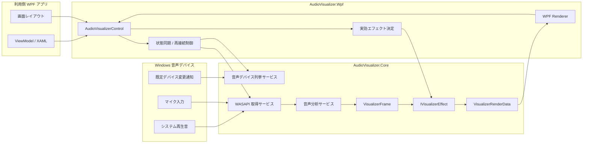

# 📘AudioVisualizer 設計書

## 1. 🏷️システム概要

* **アプリ名**：`AudioVisualizer`
* **目的**：

  * WPF アプリケーションへ組み込み可能な、再利用性の高い音声可視化コンポーネントを提供する。
  * システム再生音とマイク入力を、公開プロパティ設定および ViewModel バインドで扱えるようにする。
  * 初期提供として、組込エフェクト 5 種類を備えた `CustomControl` ベースの音声可視化部品を提供する。
  * 将来的な外部エフェクトパッケージ配布に対応しやすい拡張点を備える。
* **対象ユーザー**：

  * WPF アプリケーションに音声可視化機能を組み込みたい開発者
  * MVVM パターンで画面を構築する開発者
  * SampleApp とソースコードから利用方法を確認したい OSS 利用者

## 2. 🧰技術スタック

| 階層         | 技術・ライブラリ                                                                |
| ---------- | ----------------------------------------------------------------------- |
| 言語         | C# / XAML                                                               |
| ランタイム      | .NET 10                                                                 |
| UI フレームワーク | WPF                                                                     |
| コンポーネント形式  | `CustomControl`                                                         |
| 音声入力       | NAudio + WASAPI                                                         |
| 分析処理       | `AudioVisualizer.Core` 内の FFT / レベル計算 / 波形抽出                            |
| 描画         | WPF `OnRender` + `DrawingContext`                                       |
| サンプルアプリ    | WPF (`AudioVisualizer.SampleApp`)                                       |
| テスト        | NUnit + Microsoft.NET.Test.Sdk + NUnit3TestAdapter + coverlet.collector |

## 3. 🗂️プロジェクト構造

```txt
AudioVisualizer/
├── docs/
│   ├── 01_requirements.md          # 要件定義
│   └── 02_architect.md             # 本設計書
├── AudioVisualizer.Core/           # 音声取得抽象、分析、モデル
│   ├── Abstractions/
│   ├── Audio/
│   ├── Analysis/
│   ├── Models/
│   └── Services/
├── AudioVisualizer.Wpf/            # WPF CustomControl、描画、テーマ
│   ├── Controls/
│   ├── Effects/
│   ├── Rendering/
│   └── Themes/
├── AudioVisualizer.SampleApp/      # 利用例と手動確認用アプリ
│   ├── Views/
│   └── ViewModels/
├── AudioVisualizer.Core.Tests/     # Core の単体テスト
└── AudioVisualizer.Wpf.Tests/      # WPF 固有動作のテスト
```

## 4. 🧩機能設計

### 🎛️4.1 音声可視化コントロール

* **入力**：

  * `InputSource`
  * `DeviceId`
  * `UseDefaultDevice`
  * `IsActive`
  * `Effect`
  * `Sensitivity`
  * `Smoothing`
  * `BarCount`
  * `SpectrumProfile`
  * `PrimaryBrush`
  * `SecondaryBrush`
* **処理**：

  * `DependencyProperty` の変更を監視する。
  * `InputSource`、`DeviceId`、`UseDefaultDevice` の変更時は、`IsActive = true` の場合のみ音声取得サービスへ再接続を指示する。
  * `IsActive = false` の場合は再接続せず、設定値のみ保持する。
  * `Effect` は `null` を許容する。
  * `Effect = null` の場合、コントロールは MVP 組込エフェクトである `SpectrumBarEffect` を実効エフェクトとして使用する。
  * `Sensitivity`、`Smoothing`、`BarCount`、`SpectrumProfile` の変更時は、次回フレーム生成または次回描画から反映する。
  * `PrimaryBrush`、`SecondaryBrush` の変更時は再接続せず、再描画のみ行う。
  * 音声取得サービスから受け取った `VisualizerFrame` を現在の実効エフェクトへ渡し、`VisualizerRenderData` を生成する。
  * `VisualizerRenderData` を WPF Renderer が `DrawingContext` に変換して描画する。
  * SampleApp では、組込エフェクトの選択 UI から `Effect` を差し替えて見え方を切り替える。
* **出力**：

  * 配置領域に追従する可視化表示
* **バリデーション**：

  * `Effect` は `null` を許容する。
  * `UseDefaultDevice = false` の場合、`DeviceId` が未指定なら開始しない。
  * 未対応の `InputSource` は拒否する。
  * `Sensitivity` は 0 より大きい値のみ受け付ける。
  * `Smoothing` は `0.0`〜`1.0` を受け付ける。
  * `BarCount` は 1 以上を受け付ける。
  * `SpectrumProfile` は定義済みの列挙値のみ受け付ける。

### 🔊4.2 音声デバイス一覧取得 API

* **入力**：

  * `InputSource`
* **処理**：

  * Windows 音声デバイスを列挙し、入力種別ごとの利用可能デバイスと既定デバイスを返す。
  * `UseDefaultDevice = true` の利用を支えるため、既定デバイス変更通知を監視できる。
* **出力**：

  * `AudioDeviceInfo` 一覧
  * 既定デバイス情報
  * 既定デバイス変更イベント
* **ソート**：

  * UI 要件は持たせず、取得順を返す。
* **バリデーション**：

  * 列挙結果が空でも例外終了せず、空配列を返す。

### 🎚️4.3 音声取得と分析パイプライン

* **入力**：

  * 選択デバイス
  * 入力種別
  * 開始/停止状態
  * 分析設定
* **処理**：

  * WASAPI から PCM データを取得する。
  * 一定フレームごとに FFT、ピーク計算、波形抽出を実行する。
  * 分析結果を `VisualizerFrame` として生成する。
  * `VisualizerFrame` には少なくとも以下を含める。

    * スペクトラム値
    * 波形値
    * ピーク値
    * タイムスタンプ
* **出力**：

  * `VisualizerFrame`
* **バリデーション**：

  * 無効なデバイス指定時は開始しない。
  * デバイス開始失敗時は内部実行状態を停止のまま維持する。
  * 無音時でも例外とせず、有効な空フレームまたは減衰フレームを生成可能とする。

### 🎨4.4 エフェクト切替とレンダーデータ生成

* **入力**：

  * `IVisualizerEffect`
  * `VisualizerFrame`
  * `VisualizerEffectContext`
* **処理**：

  * エフェクトは `VisualizerFrame` を受け取り、WPF 非依存の `VisualizerRenderData` を生成する。
  * 初期提供では、以下の組込エフェクトを提供する。

    * `SpectrumBarEffect`
      バー型スペクトラムを表示する既定エフェクト。
    * `WaveformLineEffect`
      `WaveformValues` を折れ線で描画する波形エフェクト。
    * `MirrorBarEffect`
      中央基準で左右または上下対称にバーを伸ばすエフェクト。
    * `PeakHoldBarEffect`
      通常バーに加えてピーク保持線を表示するエフェクト。
    * `BandLevelMeterEffect`
      低域から高域までの固定帯域レベルをメーター表示するエフェクト。
  * エフェクトは `Metadata.SupportedInputSources` により対応 `InputSource` を宣言する。
  * 現在の入力種別に非対応のエフェクトは適用しない。
* **出力**：

  * `VisualizerRenderData`
* **バリデーション**：

  * 非対応入力種別のエフェクトはフォールバックとして `SpectrumBarEffect` を使用する。
  * レンダーデータ生成失敗時は空描画データを返却できること。

### 🧪4.5 SampleApp

* **入力**：

  * 利用者が選択した `InputSource`
  * 利用者が選択したデバイス
  * 開始/停止
  * エフェクト設定
  * スペクトラム計算プロファイル
* **処理**：

  * コントロール利用例を提示する。
  * デバイス一覧 API の利用例を提示する。
  * 既定デバイス利用と明示指定利用の切替例を提示する。
  * 組込エフェクトの選択 UI を持ち、各エフェクトの見え方を比較できるようにする。
  * `SpectrumProfile`、`BarCount`、`Sensitivity`、`Smoothing` のリアルタイム変更例を提示する。
    `SpectrumProfile` は `Balanced`、`Raw`、`HighBoost` を切り替えられる前提とする。
* **出力**：

  * 動作確認用画面
* **バリデーション**：

  * 未選択デバイス時は SampleApp 側の UI ロジックとして既定デバイス利用へフォールバック可能とする。
* **備考**：

  * このフォールバックは SampleApp の実装方針であり、コンポーネント本体仕様ではない。

## 5. 🗃️データモデル

| モデル                       | 所属層  | 役割                  | 主な項目                                                                                                                                 |
| ------------------------- | ---- | ------------------- | ------------------------------------------------------------------------------------------------------------------------------------ |
| `InputSource`             | Core | 音声入力種別の表現           | `SystemOutput`、`Microphone`                                                                                                          |
| `AudioDeviceInfo`         | Core | デバイス一覧 API の返却モデル   | `DeviceId`、`DisplayName`、`InputSource`、`IsDefault`                                                                                   |
| `VisualizerSettings`      | Core | 現在の可視化設定            | `InputSource`、`DeviceId`、`UseDefaultDevice`、`IsActive`、`Sensitivity`、`Smoothing`、`BarCount`                                          |
| `AudioSampleBuffer`       | Core | 音声取得直後の生データ         | `Samples`、`SampleRate`、`Channels`、`Timestamp`                                                                                        |
| `VisualizerFrame`         | Core | 描画直前の分析結果           | `SpectrumValues`、`WaveformValues`、`PeakLevel`、`Timestamp`                                                                            |
| `EffectMetadata`          | Core | エフェクト識別情報           | `Id`、`DisplayName`、`Version`、`Author`、`Description`、`SupportedInputSources`                                                          |
| `VisualizerEffectContext` | Core | エフェクト計算用コンテキスト      | `InputSource`、`Sensitivity`、`Smoothing`、`BarCount`、`SpectrumProfile`                                                                |
| `VisualizerRenderData`    | Core | WPF 非依存の描画指示データ基底型  | `EffectId`、`Timestamp`                                                                                                               |
| `BarSpectrumRenderData`   | Core | バー型スペクトラム用レンダーデータ   | `Bars`                                                                                                                               |
| `BarRenderItem`           | Core | 1 本分のバー描画情報         | `X`、`Width`、`Height`、`Level`                                                                                                         |
| `PolylineRenderData`      | Core | 波形線描画用レンダーデータ       | `Points`                                                                                                                             |
| `NormalizedPoint`         | Core | 正規化座標点              | `X`、`Y`                                                                                                                              |
| `PeakHoldBarRenderData`   | Core | ピーク保持バー描画用レンダーデータ | `Bars`、`PeakMarkers`                                                                                                                |
| `PeakMarkerItem`          | Core | 1 本分のピーク保持描画情報      | `X`、`Width`、`Height`                                                                                                                |
| `BandLevelMeterRenderData` | Core | 帯域メーター描画用レンダーデータ   | `Bands`                                                                                                                              |
| `BandLevelMeterItem`      | Core | 1 帯域分のメーター描画情報      | `X`、`Width`、`Level`、`Label`                                                                                                        |
| `IVisualizerEffect`       | Core | エフェクト契約             | `Metadata`、`BuildRenderData(VisualizerFrame, VisualizerEffectContext)`                                                               |
| `AudioVisualizerControl`  | Wpf  | 公開 UI コンポーネント       | `InputSource`、`DeviceId`、`UseDefaultDevice`、`IsActive`、`Effect`、`Sensitivity`、`Smoothing`、`BarCount`、`SpectrumProfile`、`PrimaryBrush`、`SecondaryBrush` |

## 6. 🗺️システム構成図



## 7. 🔌外部インターフェース

### 🧷7.1 公開 UI API

| プロパティ              | 型                    | 既定値            | 必須   | 用途         | 変更時の挙動                                                 |
| ------------------ | -------------------- | -------------- | ---- | ---------- | ------------------------------------------------------ |
| `InputSource`      | `InputSource`        | `SystemOutput` | 任意   | 入力元切替      | `IsActive = true` のとき再接続                               |
| `DeviceId`         | `string?`            | `null`         | 条件付き | 明示デバイス指定   | `IsActive = true` かつ `UseDefaultDevice = false` のとき再接続 |
| `UseDefaultDevice` | `bool`               | `true`         | 任意   | 既定デバイス利用可否 | `IsActive = true` のとき再接続                               |
| `IsActive`         | `bool`               | `false`        | 任意   | 開始/停止      | `true` で開始、`false` で停止                                 |
| `Effect`           | `IVisualizerEffect?` | `null`         | 任意   | エフェクト差し替え  | `null` の場合は `SpectrumBarEffect` を実効利用                  |
| `Sensitivity`      | `double`             | `1.0`          | 任意   | 感度補正       | 次回分析または次回描画から反映                                        |
| `Smoothing`        | `double`             | `0.82`         | 任意   | 平滑化係数      | 次回分析から反映                                               |
| `BarCount`         | `int`                | `32`           | 任意   | バー本数       | 次回分析または次回描画から反映                                        |
| `SpectrumProfile`  | `SpectrumProfile`    | `Balanced`     | 任意   | バー割り当て方式 (`Balanced` / `Raw` / `HighBoost`) | 次回描画から反映                                                |
| `PrimaryBrush`     | `Brush?`             | ライブラリ既定値       | 任意   | 主描画色       | 再描画のみ                                                  |
| `SecondaryBrush`   | `Brush?`             | `null`         | 任意   | 補助描画色      | 再描画のみ                                                  |

### 🧩7.2 公開サービス API

| 種別         | インターフェース              | 入力                                          | 出力                     | 用途                         |
| ---------- | --------------------- | ------------------------------------------- | ---------------------- | -------------------------- |
| 公開サービス API | `IAudioDeviceService` | `InputSource`                               | デバイス一覧、既定デバイス          | デバイス選択 UI を利用側で実装するために利用する |
| 公開サービス API | `IAudioInputProvider` | `InputSource`、`DeviceId`、`UseDefaultDevice` | PCM 音声データ              | 音声入力の抽象化                   |
| 公開拡張 API   | `IVisualizerEffect`   | `VisualizerFrame`、`VisualizerEffectContext` | `VisualizerRenderData` | 組込エフェクトと独自エフェクトを同一契約で扱う    |

### 🖼️7.3 RenderData 定義

* `VisualizerRenderData` は、**WPF 非依存の描画指示データ**である。
* `DrawingContext` や `Brush` などの WPF 型は含めない。
* Renderer は `VisualizerRenderData` の具体型を見て `DrawingContext` へ変換する。

#### 具体型

| 型                       | 用途               | 主な項目     | 説明                   |
| ----------------------- | ---------------- | -------- | -------------------- |
| `BarSpectrumRenderData` | バー型 / 対称バー描画 | `Bars`   | 各バーの位置と高さを正規化座標で保持する |
| `PolylineRenderData`    | 波形線描画         | `Points` | 波形や線形エフェクト用の点列を保持する  |
| `PeakHoldBarRenderData` | ピーク保持バー描画    | `Bars`、`PeakMarkers` | 通常バーとピーク保持位置を保持する |
| `BandLevelMeterRenderData` | 帯域メーター描画 | `Bands` | 固定帯域のレベルとラベルを保持する |

#### `BarRenderItem`

* `X`：左端位置（0.0〜1.0）
* `Width`：バー幅（0.0〜1.0）
* `Height`：バー高さ（0.0〜1.0）
* `Level`：元のレベル値

#### 座標系

* `RenderData` 内の座標は正規化座標系で扱う。
* `X`、`Y`、`Width`、`Height` は `0.0`〜`1.0` を基本とする。
* WPF Renderer がコントロールの `ActualWidth` / `ActualHeight` に応じて実座標へ変換する。

### 🔄7.4 状態遷移ルール

* `UseDefaultDevice = true`

  * `DeviceId` は使用しない。
  * OS の既定デバイス変更通知を監視対象とする。
  * `IsActive = true` の場合のみ再接続する。
  * `IsActive = false` の場合は再接続せず、次回開始時に最新の既定デバイスを解決する。
* `UseDefaultDevice = false`

  * `DeviceId` を明示指定デバイスとして使用する。
  * OS の既定デバイス変更通知では再接続しない。
* `IsActive = true` への遷移時

  * 実効デバイスを解決して開始する。
  * `Effect = null` の場合は `SpectrumBarEffect` を採用する。
* `IsActive = false` への遷移時

  * 音声取得を停止する。
  * 設定値は保持する。
* 開始失敗時

  * 内部実行状態は停止のままとする。
  * 最終描画結果は保持可能とする。

## 8. 🧪テスト戦略

### 🧠8.1 `AudioVisualizer.Core.Tests`

* `InputSource` 切替、`DeviceId` 指定、`UseDefaultDevice` 切替時の設定反映を検証する。
* `Effect = null` 時に実効エフェクトが `SpectrumBarEffect` へフォールバックする前提を検証する。
* WASAPI 依存箇所は抽象化し、分析処理と設定遷移を単体テストする。
* `VisualizerFrame` 生成結果について、スペクトラム値、波形値、ピーク値の妥当性を確認する。
* `BuildRenderData` が期待する `RenderData` を返すことを検証する。
* `BarSpectrumRenderData` の正規化座標が範囲内であることを確認する。

### 🖥️8.2 `AudioVisualizer.Wpf.Tests`

* `AudioVisualizerControl` の `DependencyProperty` 変更時に再接続条件が正しく評価されることを検証する。
* `IsActive = false` 時に再接続や音声取得を行わないことを検証する。
* `Effect = null` 時に既定エフェクトで描画可能であることを検証する。
* 組込エフェクトごとに期待する `VisualizerRenderData` が生成されることを検証する。
* 波形、対称バー、ピーク保持、帯域メーターの各レンダラーが例外なく描画できることを検証する。
* `PrimaryBrush`、`SecondaryBrush` 変更時に再描画のみ行うことを検証する。
* サイズ変更時に描画が破綻しないことを検証する。
* `VisualizerRenderData` から `DrawingContext` への変換が例外なく行われることを検証する。

### 🧪8.3 `AudioVisualizer.SampleApp`

* システム再生音 / マイク入力の切替確認
* 既定デバイス使用と明示デバイス指定の切替確認
* 開始 / 停止、画面リサイズ時の手動確認
* 組込エフェクト選択と切替時の見え方確認

## 9. 🛡️非機能要件

### 🎨デザイン

* 表示領域のサイズに応じて自動調整され、固定サイズ前提としない。
* 利用側アプリケーションの UI に馴染みやすい汎用的な表示とする。

### 🖱️ユーザビリティ

* XAML 配置、公開プロパティ設定、ViewModel バインドで直感的に扱える構成とする。
* デバイス選択 UI は内包せず、利用側が API を用いて実装する。
* 入力元切替、エフェクト切替、開始/停止を明確に制御できる構成とする。

### 🏷️ブランド要件

* GitHub で公開しやすい名称、構成、サンプルを維持する。
* ソリューション名は `AudioVisualizer` とし、プロジェクトは `AudioVisualizer.Core`、`AudioVisualizer.Wpf`、`AudioVisualizer.SampleApp`、`AudioVisualizer.Core.Tests`、`AudioVisualizer.Wpf.Tests` で構成する。

### ⚡パフォーマンス最適化

* 音声取得と描画処理を分離し、UI のカクつきを抑制する。
* 連続的な可視化更新に耐えられる処理構成とする。
* `IsActive = false` 時には不要な音声取得や再接続処理を行わない。
* `VisualizerRenderData` は WPF 非依存の軽量な描画指示データとして扱う。

### 🔐セキュリティ

* 現時点で明示要件なし。
* 将来的な外部エフェクトパッケージ読込を見据え、信頼性確認や安全な読込方式を追加可能な構造とする。

### 🟢可用性

* 現時点で明示要件なし。
* エフェクト生成失敗時や外部エフェクト読込失敗時に、本体全体が異常終了しにくい構造とする。

### 🛠️保守性

* `Core` と `Wpf` を分離し、WPF 依存を UI 層へ閉じ込める。
* TDD を前提とし、責務ごとにテストしやすい構造とする。
* `RenderData` を描画契約として明示し、WPF 実装と分析ロジックを疎結合に保つ。
* `EffectMetadata` と `IVisualizerEffect` を分離し、将来の外部エフェクトパッケージ拡張に備える。
* SampleApp から利用方法を確認できる状態を維持する。
